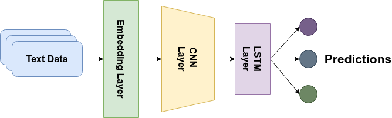
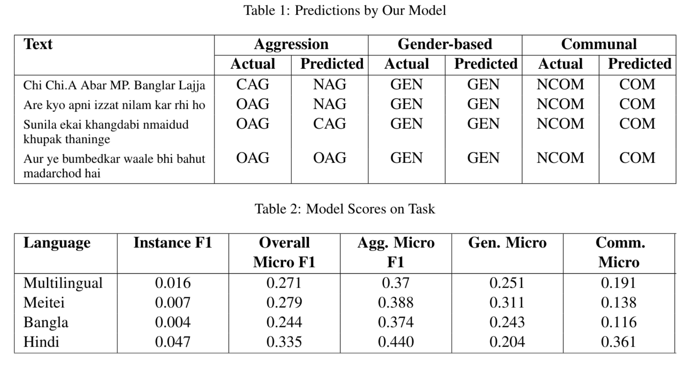

# ComMA @ ICON 2021 Shared Task

## Abstract
In today's world, online activity and social media are facing an upsurge of cases of aggression, gender-based comments and communal hate. 
Massive volumes of online content is created and collected on a daily basis, which makes it almost impossible for manual analysis. 
In this shared task, we used a CNN+LSTM hybrid method to detect aggression, gender biased and communally charged content in social media texts.
First, we employ text cleaning and convert the text into word embeddings. Next we proceed to our CNN-LSTM based model to predict the nature of the text. 
Our model achieves 0.271, 0.279, 0.244 and 0.335 Overall Micro F1 Scores in multilingual, Meitei, Bengali and Hindi datasets, respectively, on the 3 prediction labels. 

## Objective
To develop a model to detect level of aggression, misogyny and communal hate in social media posts.

## Model Explanation

## Installation and Run
Developed on Ubuntu 18.04
* Set your current working directory to `CoMMA_ICON`
* Run `bash ./set_env.sh` to set environment
* Run `bash run.sh` to run the training, validation and infernce pipeline

## Results

## Conclusion and Future Plans
Our model performs moderately on the aggression labels. However, in gender-bias and communally charged labels, it significantly under-performs.
Out of the four datasets, the model performs the best on Hindi dataset, but accuracy declines in Meitei and Multilingual datasets.

In the future, we aim to re train the model using sample weighting to obtain better results. We also aim to train using larger models to obtain better results.
